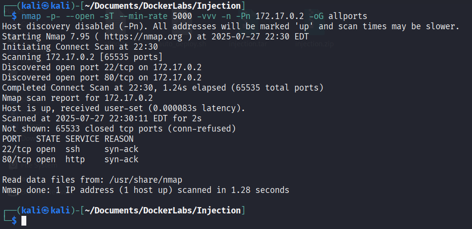
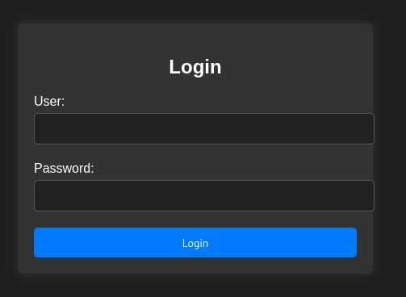
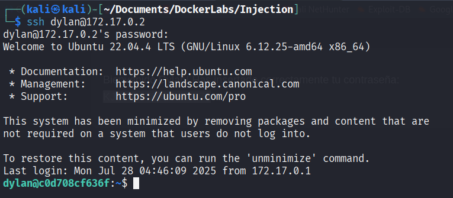
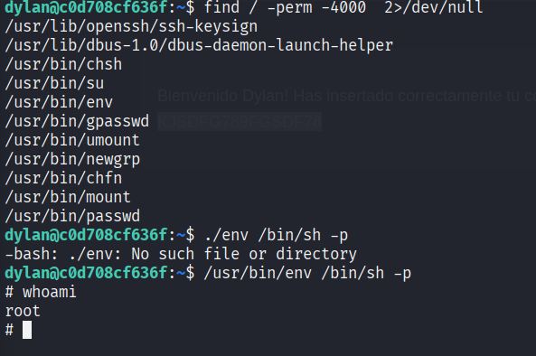

# Injection

> Máquina enfocada en la explotación de una vulnerabilidad de **SQL Injection**, obteniendo acceso inicial al sistema mediante bypass de autenticación y posterior acceso remoto por SSH.

---

# Reconocimiento

## Escaneo Nmap

Lo primero que hice fue realizar un escaneo general sobre la IP de la víctima para identificar qué puertos tenía abiertos.

sudo nmap -p- --open -sT --min-rate 5000 -vvv -n -Pn 172.17.0.2 -oG allPorts

### Parámetros utilizados

* `-p-` → Escanea los 65535 puertos TCP.
* `--open` → Muestra únicamente los puertos abiertos.
* `-sT` → Realiza un TCP Connect Scan.
* `--min-rate 5000` → Aumenta la velocidad del escaneo.
* `-vvv` → Modo verbose detallado.
* `-n` → Evita resolución DNS.
* `-Pn` → Asume que el host está activo.
* `-oG allPorts` → Guarda resultados grepables.

---

# Puertos Identificados

Gracias al escaneo pude identificar los siguientes servicios expuestos:

| Puerto   | Servicio |
| -------- | -------- |
| `22/tcp` | SSH      |
| `80/tcp` | HTTP     |

---

# Enumeración Web

Luego accedemos a la página web donde encontramos un panel de login.

Gracias al nombre de la máquina pude inferir que probablemente la vulnerabilidad principal estuviera relacionada con **SQL Injection**.

---

# Explotación

Probamos el siguiente payload:

admin' or 1=1-- -

Este payload permite omitir la validación de contraseña realizando un bypass del login.

Gracias a esto logré acceder exitosamente y obtener las credenciales del usuario `Dylan`.

---

# Acceso Inicial

Con las credenciales obtenidas intentamos acceder mediante SSH.

El acceso fue exitoso, obteniendo una shell interactiva dentro del sistema.

---

# Escalada de Privilegios

Finalmente realicé una escalada de privilegios para obtener control total del sistema.

# Máquina comprometida exitosamente ✅
