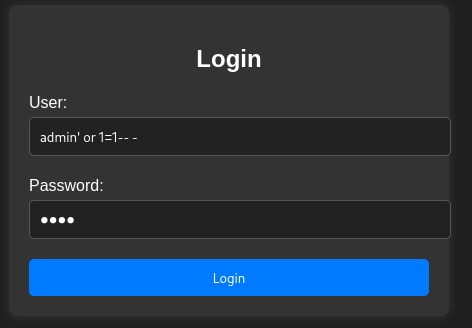

<<<<<<< HEAD:Injection/Injecition (Muy Fácil).md
# Injection
=======
lo primero que hice fue escaneo general sobre la ip de la victima para ver que puertos que tiene abiertos.
![[nmap.png]]Los parámetros utilizados son los siguiente:
-p-:	Escanea todos los 65535 puertos TCP, desde el 1 al 65535.
--open:	Muestra solo los puertos abiertos, omite los cerrados o filtrados.
-sT:	Realiza un TCP connect scan (conexión completa con el sistema operativo).
--min-rate 5000:	Envía al menos 5000 paquetes por segundo (acelera el escaneo, útil para ganar rapidez).
-vvv:	 Muestra salida muy detallada (modo muy verboso).
-n:	No realiza resolución DNS (no intenta convertir IP a nombre de dominio).
-Pn:	No hace ping previo, asume que el host está activo.
172.17.0.2: 	IP del objetivo que se quiere escanear.
-oG allPorts: Guarda los resultados en formato grepable en el archivo llamado allPorts.
>>>>>>> 9157437 (actualizacion):Injection/Injecition (Fácil).md

> Máquina enfocada en la explotación de una vulnerabilidad de **SQL Injection**, obteniendo acceso inicial al sistema mediante bypass de autenticación y posterior acceso remoto por SSH.

<<<<<<< HEAD:Injection/Injecition (Muy Fácil).md
---

# Reconocimiento

## Escaneo Nmap

Lo primero que hice fue realizar un escaneo general sobre la IP de la víctima para identificar qué puertos tenía abiertos.

### Comando utilizado

sudo nmap -p- --open -sT --min-rate 5000 -vvv -n -Pn 172.17.0.2 -oG allPorts

### Parámetros utilizados

| Parámetro | Descripción |
|---|---|
| `-p-` | Escanea los 65535 puertos TCP |
| `--open` | Muestra únicamente puertos abiertos |
| `-sT` | Realiza un TCP Connect Scan |
| `--min-rate 5000` | Aumenta la velocidad del escaneo |
| `-vvv` | Modo verbose detallado |
| `-n` | Evita resolución DNS |
| `-Pn` | Asume que el host está activo |
| `-oG allPorts` | Guarda resultados grepables |

---

# Puertos Identificados

Gracias al escaneo pude identificar los siguientes servicios expuestos:

| Puerto | Servicio |
|---|---|
| `22/tcp` | SSH |
| `80/tcp` | HTTP |

---

# Enumeración Web

Luego accedemos a la página web, donde encontramos un panel de login.

Debido al nombre de la máquina, pude inferir que probablemente la vulnerabilidad principal estuviera relacionada con **SQL Injection**.

---

# Explotación

Probamos el siguiente payload:

admin' or 1=1-- -

Este payload permite omitir la validación de contraseña realizando un bypass del login.

Gracias a esto logré acceder exitosamente y obtener las credenciales del usuario `Dylan`.

---

# Acceso Inicial

Con las credenciales obtenidas intentamos acceder mediante SSH.

El acceso fue exitoso, obteniendo una shell interactiva dentro del sistema.

---

# Escalada de Privilegios

Finalmente realizamos una escalada de privilegios para obtener control total del sistema.

# Máquina comprometida exitosamente ✅
=======
Luego accedemos a la pagina web atreves donde nos encontramos con un panel de login. 
![[Login.png]]
Gracias al nombre de la maquina puedo darme la idea de la técnica que debo utilizar la cual seria SQL Injection.
![[SQLi.png]]
probamos el parámetro **admin' or 1=1-- -**" el cual sirve para Omitir la verificación de contraseña y logra un **inicio de sesión sin necesidad de conocer la clave**, si el backend no valida correctamente las entradas.
![[SQLR.png]]
Gracias ah esto pude bypasearlo de manera exitosa y conseguí la contraseña del usuario Dylan. ahora con esto intentamos hacer una conexión atreves de SSH con este usuario y contraseña.
![[SSH.png]]Listo tengo conexión atreves de SSH ahora solo me quedaría hacer una escala de privilegios y listo.
![[Root.png]]Hemos alcanzado el nivel de privilegios máximos en el sistema!
>>>>>>> 9157437 (actualizacion):Injection/Injecition (Fácil).md
